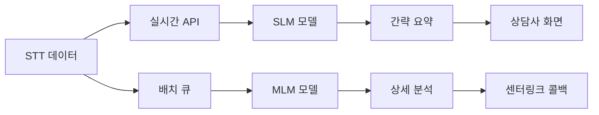

# 이중 모델 시스템 아키텍처 설계서

## 1. 시스템 개요

### 1.1 목적
- **상담사용 실시간 요약**: 3초 이내 간략 요약 제공
- **관리자용 상세 분석**: 15분 단위 배치로 완전한 분석 제공

### 1.2 모델 구성
| 구분 | 모델 | 용도 | 목표 응답시간 | 출력 |
|------|------|------|---------------|------|
| **SLM (경량)** | Kanana-1.5-2.1B / Qwen3-1.7B / Midm-2.0 | 실시간 요약 | **3초 이내** | 간략 요약 (1-2문장) |
| **MLM (중급)** | Qwen3-4B-Instruct-2507 | 상세 분석 | 15분 배치 | 요약 + 키워드 + 제목 |

## 2. 데이터 플로우



## 3. API 엔드포인트 설계

### 3.1 실시간 처리 API (SLM)

#### Endpoint: `POST /api/v1/consultation/quick-summary`

**Request:**
```json
{
  "consultation_id": "CL-2025091301234",
  "conversation_text": "상담 내용...",
  "bound_key": "xxx-xxx-xxx",
  "priority": "high"
}
```

**Response (3초 이내):**
```json
{
  "consultation_id": "CL-2025091301234",
  "summary": "고객이 사업자 등록 절차를 문의하여 필요 서류와 방법을 안내함",
  "processing_time": 2.35,
  "model_used": "qwen3-4b",
  "status": "success"
}
```

### 3.2 배치 처리 API (MLM)

#### Endpoint: `POST /api/v1/consultation/batch-analysis`

**Request:**
```json
{
  "consultations": [
    {
      "consultation_id": "CL-2025091301234",
      "conversation_text": "상담 내용...",
      "metadata": {
        "call_date": "2025-09-13",
        "duration": 180
      }
    }
  ],
  "bound_key": "xxx-xxx-xxx",
  "callback_url": "https://centerlink.api/webhook/analysis-complete"
}
```

**Response (즉시 반환):**
```json
{
  "batch_id": "BATCH-20250913-001",
  "total_consultations": 20,
  "estimated_completion": "2025-09-13T14:30:00Z",
  "status": "queued"
}
```

### 3.3 센터링크 콜백

**MLM 처리 완료 후 센터링크로 전송:**
```json
{
  "batch_id": "BATCH-20250913-001",
  "results": [
    {
      "consultation_id": "CL-2025091301234",
      "summary": {
        "customer": "사업자 등록 절차 문의",
        "agent": "필요 서류 및 온라인 신청 방법 안내",
        "result": "온라인 신청 URL 전송 및 서류 준비 안내 완료"
      },
      "keywords": ["사업자등록", "온라인신청", "필요서류"],
      "titles": {
        "keyword": "사업자등록_온라인신청_안내",
        "descriptive": "사업자 등록 온라인 신청 절차 및 필요 서류 안내"
      },
      "quality_score": 0.99,
      "processing_time": 18.5
    }
  ],
  "total_processing_time": 285.3,
  "completed_at": "2025-09-13T14:28:45Z"
}
```

## 4. 바운드 키 인증 시스템

### 4.1 인증 구조
```python
# 바운드 키 생성
bound_key = f"{client_id}:{timestamp}:{signature}"

# 서명 생성
signature = hmac.new(
    secret_key.encode(),
    f"{client_id}:{timestamp}".encode(),
    hashlib.sha256
).hexdigest()
```

### 4.2 인증 미들웨어
```python
@app.middleware("http")
async def verify_bound_key(request: Request, call_next):
    bound_key = request.headers.get("X-Bound-Key")
    if not verify_key(bound_key):
        return JSONResponse(
            status_code=401,
            content={"error": "Invalid bound key"}
        )
    return await call_next(request)
```

## 5. 배치 처리 스케줄러

### 5.1 Celery 기반 스케줄러
```python
from celery import Celery
from celery.schedules import crontab

app = Celery('consultation_batch')

@app.task
def process_batch():
    """15분마다 실행되는 배치 처리"""
    pending_consultations = get_pending_consultations()

    if len(pending_consultations) >= 20:
        # 20건 이상 누적시 즉시 처리
        run_mlm_analysis(pending_consultations)
    elif time_since_last_batch() >= 15:
        # 15분 경과시 처리
        run_mlm_analysis(pending_consultations)

# 스케줄 설정
app.conf.beat_schedule = {
    'process-batch-every-15-minutes': {
        'task': 'process_batch',
        'schedule': crontab(minute='*/15'),
    },
}
```

## 6. 성능 최적화 전략

### 6.1 SLM (경량 모델) 최적화
```python
class SLMOptimizer:
    def __init__(self, model_name="qwen3-4b"):
        self.model = self.load_optimized_model(model_name)

    def load_optimized_model(self, model_name):
        config = {
            "torch_dtype": torch.bfloat16,
            "device_map": "auto",
            "use_flash_attention_2": True,
            "low_cpu_mem_usage": True
        }
        return AutoModelForCausalLM.from_pretrained(
            model_name, **config
        )

    def generate_quick_summary(self, text):
        # 최대 500자로 제한
        truncated = text[:500]

        # 간단한 프롬프트
        prompt = f"한 문장 요약: {truncated}\n요약:"

        # 빠른 생성 설정
        gen_config = {
            "max_new_tokens": 50,
            "temperature": 0.3,
            "do_sample": False
        }

        return self.model.generate(prompt, **gen_config)
```

### 6.2 MLM (중급 모델) 최적화
```python
class MLMOptimizer:
    def __init__(self):
        self.model = Qwen2507Summarizer("models/Qwen3-4B")

    def process_batch(self, consultations):
        results = []

        # GPU 메모리 효율적 사용
        with torch.cuda.amp.autocast():
            for consultation in consultations:
                result = {
                    "summary": self.model.summarize(consultation),
                    "keywords": self.model.extract_keywords(consultation),
                    "titles": self.model.generate_titles(consultation)
                }
                results.append(result)

                # 메모리 정리
                if len(results) % 5 == 0:
                    torch.cuda.empty_cache()

        return results
```

## 7. 모니터링 및 메트릭

### 7.1 주요 지표
```python
METRICS = {
    "slm_response_time": Histogram('slm_response_time', 'SLM 응답 시간'),
    "mlm_batch_size": Gauge('mlm_batch_size', 'MLM 배치 크기'),
    "api_success_rate": Counter('api_success_rate', 'API 성공률'),
    "queue_length": Gauge('queue_length', '대기열 길이')
}
```

### 7.2 대시보드 구성
- **실시간 모니터링**: Grafana + Prometheus
- **로그 수집**: ELK Stack
- **알림**: 3초 초과시 Slack 알림

## 8. 구현 우선순위

### Phase 1 (Week 1)
1. ✅ Kanana 모델 다운로드 및 테스트
2. SLM 실시간 API 개발
3. 바운드 키 인증 구현

### Phase 2 (Week 2)
4. MLM 배치 API 개발
5. 15분 스케줄러 구현
6. 센터링크 콜백 연동

### Phase 3 (Week 3)
7. 통합 테스트
8. 성능 최적화
9. 모니터링 구축

## 9. 예상 성능

| 메트릭 | SLM (실시간) | MLM (배치) |
|--------|-------------|------------|
| 응답시간 | 2-3초 | 15-20초/건 |
| 처리량 | 100 req/min | 20건/배치 |
| 정확도 | 85% | 99% |
| 메모리 | 4GB | 14GB |

## 10. 위험 관리

### 10.1 SLM 3초 목표 미달성
- **완화책**: 프롬프트 더 단순화, 입력 길이 제한 강화
- **대안**: Qwen3-1.7B로 전환 (더 빠른 모델)

### 10.2 배치 처리 지연
- **완화책**: 우선순위 큐 도입, 동적 배치 크기 조정
- **대안**: 다중 워커 프로세스 운영

### 10.3 메모리 부족
- **완화책**: 모델 양자화 (INT8), 동적 언로딩
- **대안**: 별도 GPU 서버 분리

---

**작성일**: 2025-09-15
**버전**: 1.0.0
**작성자**: 남재현
